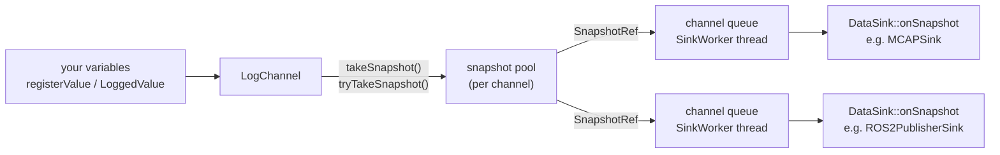

# data_tamer user manual for coding agents

data_tamer records the values of many C++ variables at once, as one "snapshot" per call,
usually from a periodic control loop, and delivers the snapshots to sinks: MCAP files, a
RAM flight recorder, ROS 2 topics or your own sink. This manual is for an agent adding
data_tamer logging to another code base. Header paths are relative to
`data_tamer_cpp/include/`. To change the library itself, read `CLAUDE.md` instead.

## Linking

Consumers need C++17. Under ROS 2, add `<depend>data_tamer_cpp</depend>` to
`package.xml` and:

```cmake
find_package(data_tamer_cpp REQUIRED)
target_link_libraries(my_node PRIVATE data_tamer_cpp::data_tamer)
```

Without ROS, after installing the library:

```cmake
find_package(data_tamer REQUIRED)
target_link_libraries(my_app PRIVATE data_tamer::data_tamer)
```

`ROS2PublisherSink` exists only in the ROS 2 build (the build defines `USING_ROS2`).

## Mental model



- `ChannelsRegistry` (`data_tamer/data_tamer.hpp`) creates channels by name, applies
  default settings and attaches default sinks to them, and stops every sink at shutdown
  (`stopAll()`). `ChannelsRegistry::Global()` is a process-wide instance. You can also
  create channels directly with `LogChannel::create(name)`.
- `LogChannel` (`data_tamer/channel.hpp`) holds pointers to registered variables. It
  reads them only when you take a snapshot. One channel is one schema and one rate: use
  several channels for several loops or rates.
- `prepare()` freezes the schema, allocates a pool of snapshot slots plus one queue per
  attached sink, as long as the pool, and announces the schema to every attached sink
  (`DataSink::onSchema()`).
- `takeSnapshot()` or `tryTakeSnapshot()` serializes every enabled value into a free pool
  slot and pushes a reference (`SnapshotRef`) into the channel's queue on each attached
  sink. The slot returns to the pool when the last sink releases its reference. A queued
  reference holds a slot, so a queue can't fill while the pool has a free slot: the pool
  is the only bound.
- `SinkWorker` (`data_tamer/data_sink.hpp`) owns one `DataSink`, the queues of the
  channels attached to it and the thread that calls `onSnapshot()`. Channels take sinks
  as `std::shared_ptr<SinkWorker>`.

## Headers

| You need | Include |
|---|---|
| `LogChannel`, `LoggedValue`, `JoinNames`, `SnapshotResult` | `data_tamer/channel.hpp` |
| `ChannelsRegistry` | `data_tamer/data_tamer.hpp` (plus `channel.hpp` to use a channel) |
| `DataSink`, `SinkWorker`, `Snapshot`, `SnapshotRef` | `data_tamer/data_sink.hpp` |
| `Schema`, `ToStr(schema)`, `SchemaFormat` | `data_tamer/types.hpp` |
| `TypeDefinitionTrait` | `data_tamer/custom_types.hpp` (also pulled in by `channel.hpp`) |
| `MCAPSink` | `data_tamer/sinks/mcap_sink.hpp` |
| `MCAPRingSink`, `MCAPRingOptions` | `data_tamer/sinks/mcap_ring_sink.hpp` |
| `ROS2PublisherSink`, `ROS2PublisherOptions` | `data_tamer/sinks/ros2_publisher_sink.hpp` |
| `DummySink` (tests) | `data_tamer/sinks/dummy_sink.hpp` |
| forward declarations only | `data_tamer/fwd.hpp` |

`data_tamer/data_tamer.hpp` includes only `fwd.hpp`. Code that calls `LogChannel` members
must include `data_tamer/channel.hpp`, even if it got the channel from the registry.

## Minimal end-to-end example

A 1 kHz loop that logs four joints, a cycle time and a mode to an MCAP file. It compiles
as C++17 against the current headers and decodes with the Python reader.

```cpp
#include "data_tamer/channel.hpp"
#include "data_tamer/sinks/mcap_sink.hpp"

#include <array>
#include <chrono>
#include <cmath>
#include <cstdio>
#include <string_view>
#include <thread>

namespace robot
{
struct JointState
{
  double position = 0;
  double velocity = 0;
  float effort = 0;
};
}  // namespace robot

// Describes JointState without touching namespace robot.
template <>
struct DataTamer::TypeDefinitionTrait<robot::JointState>
{
  template <typename AddField>
  static std::string_view define(robot::JointState& js, AddField& add)
  {
    add("position", &js.position);
    add("velocity", &js.velocity);
    add("effort", &js.effort);
    return "JointState";
  }
};

int main()
{
  using namespace std::chrono_literals;
  using DataTamer::SnapshotResult;

  // Registered variables are declared before the channel, so they outlive it.
  std::array<robot::JointState, 4> joints{};
  double cycle_time_ms = 0;

  auto mcap = DataTamer::MCAPSink::create("control.mcap");
  // Every 10 minutes the recording continues in control_1.mcap, control_2.mcap, ...
  // (the default). setCreateNewFileOnReset(false) would truncate control.mcap instead.

  auto channel = DataTamer::LogChannel::create("control");
  channel->addDataSink(mcap);

  const std::array<const char*, 4> legs = { "LF", "RF", "LH", "RH" };
  for(size_t i = 0; i < joints.size(); ++i)
  {
    channel->registerValue(DataTamer::JoinNames("joints", legs[i]), &joints[i]);
  }
  channel->registerValue("cycle_time_ms", &cycle_time_ms);
  auto mode = channel->createLoggedValue<int32_t>("mode");  // RAII, atomic

  channel->setPoolCapacity(200ms, 1ms);  // absorb a 200 ms sink stall at 1 kHz
  channel->prepare();             // freeze schema, allocate pool, announce

  uint64_t lost = 0;
  for(int i = 0; i < 2000; ++i)  // 1 kHz control loop
  {
    const auto start = std::chrono::steady_clock::now();
    for(auto& joint : joints)
    {
      joint.position = std::sin(i * 0.001);
      joint.velocity = std::cos(i * 0.001);
    }
    mode->set(i < 1000 ? 0 : 1);

    switch(channel->tryTakeSnapshot())
    {
      case SnapshotResult::ok:
        break;
      case SnapshotResult::partial:         // a sink was stopped
      case SnapshotResult::rejected:        // every sink was stopped
      case SnapshotResult::pool_exhausted:  // sinks hold every slot
      case SnapshotResult::blocked:         // a writer held scopedWrite()
      case SnapshotResult::oversize:        // payload outgrew the slot
        ++lost;                             // count, never block or log here
        break;
      case SnapshotResult::no_sinks:
      case SnapshotResult::not_prepared:
        break;
    }
    cycle_time_ms = std::chrono::duration<double, std::milli>(
                        std::chrono::steady_clock::now() - start)
                        .count();
    std::this_thread::sleep_for(1ms);
  }

  mcap->stop();  // deliver what is still queued, then close the file
  const auto stats = channel->stats();
  std::printf("lost %llu, pool_exhausted %llu, oversize %llu, sink errors %llu\n",
              static_cast<unsigned long long>(lost),
              static_cast<unsigned long long>(stats.pool_exhausted),
              static_cast<unsigned long long>(stats.dropped_oversize),
              static_cast<unsigned long long>(mcap->errors()));
  return 0;
}
```

The recorded names are `joints/LF/position`, `joints/LF/velocity`, ...,
`cycle_time_ms` and `mode`.

## Registering values

`LogChannel` (`data_tamer/channel.hpp`) offers:

- `registerValue(name, const T* ptr)` for arithmetic types, `bool`, `char`, enums
  (recorded as their underlying type), `std::atomic<T>` of those (read with a relaxed
  load), `std::vector<T>`, `std::array<T, N>` (N from 1 to 65535) and custom types (see
  [Custom types](#custom-types)). Returns a `RegistrationID`.
- `createLoggedValue<T>(name, initial_value = T{})` returns a
  `std::shared_ptr<LoggedValue<T>>` that owns the variable and unregisters it in its
  destructor (`data_tamer/logged_value.hpp`). `T` defaults to `double`.
- `registerCustomValue(name, ptr, CustomSerializer::Ptr)` bypasses the built-in
  serialization. Generic decoders may not be able to read the result: prefer a custom
  type.

The wire format has no string type. A `std::string` registers as `char[]`, a vector of
`char`, and decoders produce one numeric field per character. Do not log text.

### Names

- A name must be unique in its channel. Registering a name that is already registered
  throws `std::runtime_error` ("registered twice").
- A name must not contain a space (`std::runtime_error`). A failed registration leaves the
  channel unchanged.
- Registration accepts empty `/`-separated components (`"/loco//x/"`), but PlotJuggler
  shows them as empty path elements. Build hierarchical names with
  `DataTamer::JoinNames(parts...)` (`data_tamer/names.hpp`), which drops empty components:
  `JoinNames("/loco/", "LF/", "x") == "loco/LF/x"`. Enforce the rule with
  `assert(DataTamer::IsCanonicalName(name))` if you want to.
- Custom type fields, vector elements and array elements extend the name with `/field`
  and `[i]` in decoders: `joints/LF/position`, `path/points[2]/x`.

### When registration is allowed

All values must be registered before the schema freezes. `prepare()` freezes it, and so
does the first `takeSnapshot()` that finds a sink attached (a `takeSnapshot()` without
sinks returns `no_sinks` and leaves the schema open). After the freeze:

- registering a new name throws `std::runtime_error` ("can't register new value ... once
  recording started");
- `setPoolCapacity()` and `setPayloadCapacity()` throw `std::runtime_error`;
- a name that was unregistered can be registered again with the same type, reusing its
  slot in the schema. A different type throws `std::runtime_error`.

`unregister(id)` keeps the value in the schema, recorded as disabled. It waits for a
snapshot in progress, so never call it from a real-time thread. It throws
`std::invalid_argument` for an id that is stale (the name was registered again since) or
invalid.

### Pointer lifetime

The channel borrows each pointer until `unregister()` returns or the channel is
destroyed, and dereferences it at every snapshot. A dangling pointer is not detected.

- Declare registered variables before the channel that reads them, as locals and as
  class members alike: members are destroyed in reverse order of declaration.
- Do not register an element of a `std::vector` and then grow the vector: reallocation
  moves the elements. Register the vector itself (`registerValue("v", &v)`), which reads
  its size and data at each snapshot, or reserve the final size first.
- Do not register a member of an object that is later moved or copied into another
  location (a container element, a temporary).
- Prefer `createLoggedValue()` when the value has no natural owner. `LoggedValue` is not
  copyable or movable, so the pointer it registered stays valid.

### Enabling and disabling

- `setEnabled(id, bool)` is lock-free and allocation-free and throws
  `std::invalid_argument` for a stale or invalid id.
- `trySetEnabled(id, bool)` is `noexcept` and returns false instead: use it on real-time
  threads.
- `isEnabled(id)` is false after `unregister()`.
- `LoggedValue::setEnabled(bool)` and `isEnabled()` work even after the channel is gone.
- A disabled value costs one bit of the snapshot's active mask and no payload.
  `LoggedValue::set()` does not re-enable a disabled value.

Enabling or disabling is much cheaper than registering or unregistering, and is the way
to change what is recorded at run time.

## Writing values from other threads

The thread that calls `takeSnapshot()` can write registered variables directly. Other
threads must follow these rules:

- A variable registered with `registerValue()` is written only inside
  `auto tx = channel->scopedWrite();`. The snapshot thread reads it without any lock of
  its own.
- A scalar `LoggedValue<T>` (`LoggedValue<T>::kAtomic`: arithmetic, `bool`, `char` or
  enum, at most 8 bytes, lock-free atomic) stores a `std::atomic<T>`: `set()` and `get()`
  are wait-free relaxed operations.
- A non-scalar `LoggedValue<T>` (a struct, a vector) takes the channel's write mutex in
  `set()` and `get()`. `getMutablePtr()` and `getConstPtr()` return guards that hold the
  mutex while they live. All of these nest inside a `scopedWrite()` on the same thread.

Each value is captured untorn, but two separate writes can land in different snapshots.
To keep several values consistent with each other (a position and the velocity computed
from it), write them in one transaction:

```cpp
{
  auto tx = channel->scopedWrite();
  target->set(nav::Point{ 3.0, 4.0 });  // LoggedValue<nav::Point>
  speed->set(0.5);                      // LoggedValue<double>
  path.id = 7;                          // raw registered value
}
```

Keep transactions and pointer guards short and free of blocking calls. `takeSnapshot()`
spins for 2 microseconds (`WriteMutex::kLockSpinNs`) and then blocks on the mutex, with
priority inheritance where POSIX provides it. `tryTakeSnapshot()` returns `blocked`
instead. Release guards before taking a snapshot on the same thread.

The `LoggedValue` destructor unregisters, which locks and waits for a snapshot in
progress: never release the last `shared_ptr` on a real-time thread or inside a
`scopedWrite()`.

## Custom types

A struct is recorded field by field once data_tamer knows its fields. Specialize
`DataTamer::TypeDefinitionTrait<T>` (`data_tamer/contrib/SerializeMe.hpp`, reached
through `data_tamer/custom_types.hpp`): it works for types you cannot modify and needs
no change to their namespace. See the `JointState` trait in the
[end-to-end example](#minimal-end-to-end-example).

The older alternative is a free function `TypeDefinition()` in the namespace of the type,
found by argument-dependent lookup. Fields can be numbers, enums, other custom types, and
`std::vector` or `std::array` of those:

```cpp
namespace nav
{
struct Point
{
  double x = 0;
  double y = 0;
};
struct Path
{
  std::vector<Point> points;
  std::array<float, 3> color{};
  uint32_t id = 0;
};
template <typename AddField>
std::string_view TypeDefinition(Point& p, AddField& add)
{
  add("x", &p.x);
  add("y", &p.y);
  return "Point";
}
template <typename AddField>
std::string_view TypeDefinition(Path& p, AddField& add)
{
  add("points", &p.points);
  add("color", &p.color);
  add("id", &p.id);
  return "Path";
}
}  // namespace nav
```

`channel->registerValue("path", &path)` then produces this schema (`ToStr(schema)`,
header lines omitted):

```text
Path path
===========================================================
MSG: Path
Point[] points
float32[3] color
uint32 id
===========================================================
MSG: Point
float64 x
float64 y
```

Rules:

- The type must be default constructible: the channel builds a dummy instance to
  discover the fields.
- `define()` or `TypeDefinition()` returns the type name. A `std::string_view` or
  `const char*` must point to storage that outlives the program (a string literal). A
  returned `std::string` is evaluated once and cached.
- For class templates, the trait can add `static std::string name()` (e.g.
  `"Vector" + std::to_string(N)`). `define()` may then return `void`.
- Partial specializations use the second, defaulted template parameter
  (`std::enable_if_t<...>` or `std::void_t<...>`).
- If both a trait and a `TypeDefinition()` exist, the trait is used. A trait whose
  `define()` cannot be called as `define(T&, AddField&)` is a compile error.
- The specialization must be visible wherever the type is registered.
- The channel keys custom types by the returned name: give each C++ type its own name.

## Preparing the channel

Call `channel->prepare()` once, after registration and before the loop, on a non
real-time thread. It:

- freezes the schema;
- allocates the snapshot pool: `setPoolCapacity()` slots (default 64), each reserving the
  payload bytes described in [Payload capacity](#payload-capacity-per-slot);
- allocates, for each attached sink, a queue holding as many references as the pool has
  slots (24 bytes each). A sink attached later gets its queue in `addDataSink()`;
- calls `onSchema()` of every attached sink on the calling thread. `MCAPSink` registers
  the MCAP channel, and `ROS2PublisherSink` publishes the schema catalog over DDS.

If a sink throws from `onSchema()`, `prepare()` rethrows and leaves the channel as it was
(schema open, pool released), so fixing the cause and calling it again is enough. The
queues are allocated last: if that throws (`std::bad_alloc`), the schema stays frozen with
its pool, nothing is published, and calling `prepare()` again retries the allocation. `prepare()` also works without sinks:
a sink added later receives the schema inside `addDataSink()`. `isPrepared()` reports the
state. `takeSnapshot()` prepares the channel implicitly, with its allocations and sink
callbacks, which is why an explicit `prepare()` belongs outside the control loop.

## Taking snapshots

Only one thread per channel may call `takeSnapshot()` or `tryTakeSnapshot()`.

| | `takeSnapshot()` | `tryTakeSnapshot()` |
|---|---|---|
| Before `prepare()` | prepares the channel if a sink is attached | returns `not_prepared` |
| Write mutex held by a writer | spins 2 us, then blocks | spins 2 us, then returns `blocked` |
| Payload larger than the slot | grows the slot (allocates) | returns `oversize` |
| Use from a real-time thread | no | yes |

Both return a `[[nodiscard]] SnapshotResult`. Cast to `(void)` to ignore it on purpose.

| Result | Meaning | What to do |
|---|---|---|
| `ok` | Captured and queued by every sink. | Nothing. |
| `partial` | Captured, but some sinks refused it because their `SinkWorker` is stopped. | Check `droppedSnapshots(sink)`; `start()` the worker or detach it. |
| `rejected` | Captured, but every sink refused it (every worker stopped). | Same as `partial`. |
| `no_sinks` | No sink attached; nothing captured. Before `prepare()` the schema stays open. | Attach a sink. |
| `not_prepared` | `tryTakeSnapshot()` before `prepare()`; nothing captured. | Call `prepare()` first. |
| `pool_exhausted` | Sinks still hold every pool slot; the sample is lost for every sink. | Raise `setPoolCapacity()`, or fix the slow sink. |
| `oversize` | `tryTakeSnapshot()`: the payload outgrew the slot. | Raise `setPayloadCapacity()`. |
| `blocked` | `tryTakeSnapshot()`: a writer held the write mutex past the spin budget. | Shorten `scopedWrite()` scopes and pointer guards. |

On a real-time thread, count these outcomes and report them from another thread. Do not
log, allocate or retry inside the loop.

### Timestamps

The timestamp argument defaults to `DataTamer::NsecSinceEpoch()`: `std::chrono::system_clock`
in nanoseconds since the epoch. Pass your own `std::chrono::nanoseconds` (simulation
time, sensor time) when it is the time that matters. The timestamp becomes the MCAP log
and publish time, `timestamp_nsec` in ROS messages, and the time base of the
`MCAPRingSink` window. Use one clock for all channels that end up in one file.

## Sinks

The `create()` helpers return a `std::shared_ptr<SinkWorker>`. Reach the sink's own
methods with `worker->as<T>()`, which throws `std::bad_cast` for the wrong type.

- `channel->addDataSink(worker)` attaches a sink and returns `true`. A channel holds at
  most eight sinks (a ninth throws `std::runtime_error`). Adding the same sink twice does
  nothing and returns `false`.
- One sink can serve many channels; each channel's schema reaches it once.
- `ChannelsRegistry::addDefaultSink(worker)` attaches the sink to every channel of the
  registry, existing ones included, and to every channel `getChannel()` creates later.
  See [Registry](#registry).
- `SinkWorker::stop()` stops accepting snapshots, waits for the callback in progress,
  delivers everything still queued and then finishes the sink (`DataSink::onStop()`):
  see [Shutdown](#shutdown). It is idempotent and never callable from a callback.
  `start()` resumes, and first lets the sink reopen (`DataSink::onStart()`). `drain()`
  delivers the queues on the calling thread.
- Each channel's snapshots reach `onSnapshot()` in the order they were taken. The worker
  serves its channels in turn, so snapshots of different channels interleave in no
  guaranteed order. `removeDataSink()` (or destroying the channel) lets the worker
  deliver what that channel had queued, then frees the queue.
- `SinkWorker::errors()` counts `onSnapshot()`, `onStop()` and `onStart()` calls that threw;
  `lastError()` returns the last message.
- `SinkWorker(std::unique_ptr<DataSink>, Delivery::Threaded)` builds a worker by hand, to
  choose `Delivery::Manual` (no thread: you call `drain()`). There is no queue size to
  set.

### Shutdown

`SinkWorker::stop()` delivers what is queued, then calls the sink's `onStop()` on the
calling thread, serialized with the other callbacks. Each sink finishes itself there:

| Sink | `onStop()` |
|---|---|
| `MCAPSink` | `stopRecording()`: closes the file, which is then complete (summary and footer written). |
| `MCAPRingSink` | `flushPendingDump()`: writes a dump requested but not yet triggered or completed, and waits for the writer. |
| `ROS2PublisherSink` | `flush()`: publishes the partial batch and a schema catalog whose publication failed. |
| Custom sinks | Nothing, unless they override `onStop()`. |

- `onStop()` runs once per stop. A second `stop()` without `start()` in between does not
  call it again.
- Destroying a worker that is still running calls `stop()`, so the sink is finished then
  too.
- A throw from `onStop()` is counted in `errors()` and does not leave `stop()`.
- `start()` after a stop calls the sink's `onStart()` on the calling thread, before the
  worker accepts snapshots again: `MCAPSink` records into its next numbered file (unless
  `restartRecording()` opened one meanwhile); the other sinks need nothing. It is not
  called when the worker is constructed. A throw is counted in `errors()`.
- `ChannelsRegistry::stopAll()` stops every sink of a registry in one call.

So a program shuts down with one call per worker, or one for the whole registry, and no
ordering rules:

```cpp
// Every default sink and every sink attached to a registry channel, once each.
DataTamer::ChannelsRegistry::Global().stopAll();
```

### Registry

`ChannelsRegistry` (`data_tamer/data_tamer.hpp`) is the session object: it owns the
channels it creates, their default sinks and their default settings.

- `getChannel(name)` creates the channel on first use. It applies the channel defaults,
  then attaches the default sinks.
- `addDefaultSink(worker)` attaches the sink to every existing channel and to every
  channel created later. A prepared channel announces its schema to the sink at once
  (`onSchema()` on the calling thread). A channel that holds the sink already keeps it.
  If one channel refuses the sink (it holds eight sinks already, or `onSchema()` throws),
  the call is undone: the channels it attached the sink to drop it again, it does not
  become a default sink, and the exception propagates. The existing channels are attached
  without the registry lock, so `onSchema()` may use the registry; a channel that
  `getChannel()` creates meanwhile gets the sink and keeps it. Default sinks can be added before
  or after the channels exist.
- `setChannelDefaults(ChannelDefaults{...})` sets what `getChannel()` applies to the
  channels it creates from then on (table below). Existing channels are not changed:
  their owner may have configured them, and their sizes freeze at `prepare()`. A field
  left at zero keeps the library default. The values are checked when the call is made
  (`ChannelDefaults::resolve()`, which throws `std::invalid_argument` or
  `std::length_error` like the `LogChannel` setters), and a refused call keeps the
  previous defaults.
- `stopAll()` calls `SinkWorker::stop()` once on every default sink and every sink
  attached to a channel the registry created, however it was attached, in no particular
  order, on the calling thread. Sinks of channels made with `LogChannel::create()` are
  reached only if they are default sinks. The sinks stay attached; `start()` resumes one.
- `clear()` drops the channels, the default sinks and the channel defaults.

| `ChannelDefaults` field | Applied as |
|---|---|
| `pool_capacity` | `setPoolCapacity(count)` |
| `pool_stall_tolerance`, `pool_snapshot_period` | `setPoolCapacity(stall, period)`: set both, and not together with `pool_capacity` |
| `payload_capacity` | `setPayloadCapacity(bytes)` |

```cpp
using namespace std::chrono_literals;
auto& registry = DataTamer::ChannelsRegistry::Global();
DataTamer::ChannelDefaults defaults;
defaults.pool_stall_tolerance = 200ms;  // absorb a 200 ms sink stall ...
defaults.pool_snapshot_period = 1ms;    // ... at 1 kHz: 200 slots
registry.setChannelDefaults(defaults);
registry.addDefaultSink(DataTamer::MCAPSink::create("run.mcap"));
auto channel = registry.getChannel("controller");  // 200 slots, MCAP attached
// ... register, prepare, log ...
registry.stopAll();  // run.mcap is complete
```

### MCAPSink

`MCAPSink::create(filepath, do_compression = false)` (`data_tamer/sinks/mcap_sink.hpp`)
opens the file in its constructor and throws `std::runtime_error` if it cannot. An
existing file at that path is overwritten.

- Reset: by default the file is reset after 600 seconds of wall-clock time
  (`system_clock`, measured from file open), and the recording continues in numbered
  files (`run.mcap`, `run_1.mcap`, `run_2.mcap`, ...), skipping names that exist.
  Nothing is lost and disk usage is unbounded.
- `setCreateNewFileOnReset(false)` truncates and restarts the same file instead, which
  discards what it held and bounds disk usage to the last 10 minutes. Use it only for a
  recording you never keep, such as a rolling debug log.
- `setMaxTimeBeforeReset(std::chrono::seconds(0))` disables resets: one file that grows
  for as long as the process runs.
- `do_compression = true` writes zstd chunks. A crash loses more data than with an
  uncompressed file.
- `worker->stop()` delivers what is queued and closes the file (see
  [Shutdown](#shutdown)); so does destroying the worker.
- `stopRecording()` closes the file without stopping the worker and drops later
  snapshots; `restartRecording(filepath, do_compression = false)` opens a new file and
  rewrites the known schemas into it. `start()` after `stop()` records into the next
  numbered file (as a reset does), unless `restartRecording()` opened a file meanwhile.
- A failed write throws from `onSnapshot()` and shows in `worker->errors()`.

`data_tamer/sinks/mcap_encoding.hpp` exposes the same encoding (`AddChannel()`,
`WriteSnapshot()`) for a custom sink that writes MCAP files itself.

### MCAPRingSink (flight recorder)

`MCAPRingSink` (`data_tamer/sinks/mcap_ring_sink.hpp`) keeps the recent past of every
attached channel in RAM and writes an MCAP file only when asked.

| `MCAPRingOptions` field | Default | Meaning |
|---|---|---|
| `filepath` | `"flight_recorder.mcap"` | Dump N goes to `flight_recorder_N.mcap`; existing names are skipped. |
| `window` | 10 s | History kept before the trigger, in snapshot time. |
| `capacity_bytes` | 64 MiB | Size of the ring. |
| `compression` | false | zstd compression of the dump files. |

```cpp
MCAPRingOptions ring_options;
ring_options.filepath = "fault.mcap";
ring_options.window = 5s;
ring_options.capacity_bytes = size_t(16) << 20;
auto ring = MCAPRingSink::create(ring_options);
auto& recorder = ring->as<MCAPRingSink>();
recorder.setDumpCallback([](const MCAPRingDump& dump) {
  std::printf("%s %s %zu messages truncated=%d %s\n", dump.ok ? "wrote" : "FAILED",
              dump.path.c_str(), dump.messages, dump.truncated, dump.error.c_str());
});
channel->addDataSink(ring);
// ... in the loop, from any thread, real-time ones included:
recorder.requestDump(10ms);  // also keep 10 ms after the trigger
// ... at shutdown: delivers what is queued, then writes a pending request
ring->stop();
```

- Memory: the ring and a second buffer of the same size, for the dump being written, are
  both allocated in the constructor: about `2 x capacity_bytes`. Each stored snapshot
  takes 24 bytes plus its mask and payload. Size the ring for
  `snapshot rate x (window + post_trigger) x record size`, summed over channels.
- `requestDump(post_trigger = 0)` is one compare-exchange: lock-free, allocation-free.
  It returns false, and the request is ignored, while an earlier request is active (from
  its `requestDump()` until its dump is handed to the writer thread). Requests are not
  merged.
- Trigger: the first snapshot the sink receives after the request, with time `T`. The
  file holds the stored snapshots of all channels stamped in
  `[T - window, T + post_trigger]`. Delivery runs behind the producer when the queues are
  backed up, so `T` can be later than the snapshot taken when you called
  `requestDump()`.
- The dump completes at the first delivered snapshot stamped after `T + post_trigger`.
  Snapshots of another channel delivered after that one are not included, even if
  stamped earlier.
- When the ring is full, the oldest snapshots are evicted even if younger than `window`;
  the dump then reports `truncated = true`. Raise `capacity_bytes`. A complete dump that
  waits for a busy writer can lose part or all of its interval that way, and reports it
  the same way.
- A writer thread writes the files and runs the dump callback. The callback can call
  `stats()`, `dumpRequested()` and `requestDump()`. `waitForWriter()` and
  `flushPendingDump()` throw `std::logic_error` there.
- `flushPendingDump()` writes the active request now and waits for the file: a request
  no snapshot has triggered yet uses the newest timestamp seen as trigger, a dump still
  collecting its post-trigger interval is cut there. It is safe while the worker is
  running, so there is no need to stop and restart the worker around it; snapshots still
  queued are not in the ring yet. It returns true if a request was active.
- `SinkWorker::stop()` calls `flushPendingDump()` after the last delivery, so a request
  made just before shutdown is written by `stop()`, or by destroying the worker.
- `MCAPRingDump::ok` is false on an I/O error (full disk), with `error` set.
  `stats()` returns `dumps_written`, `dumps_failed`, `writer_busy_retries`,
  `evicted_by_capacity`, `dropped_oversize` (snapshots larger than the whole ring),
  `stored_snapshots`, `stored_bytes`, and `oldest_timestamp` and `newest_timestamp`,
  the snapshot times of the first and last record in the ring (both 0 when it is empty).
  Each field has its own getter (`dumpsWritten()`, ..., `newestTimestamp()`); `stats()`
  is an inline function that calls them one by one, so with the worker running the
  fields can come from slightly different moments.
- Coverage check: `newest_timestamp - oldest_timestamp` is the history the ring holds.
  If it stays below `window` while `evicted_by_capacity` grows, raise `capacity_bytes`.
  The records are in delivery order, so with several channels the two values can be off
  by the delivery skew between channels.

### ROS2PublisherSink

`ROS2PublisherSink::create(node, topic_prefix, options = {})`
(`data_tamer/sinks/ros2_publisher_sink.hpp`) takes an `rclcpp::Node`, an
`rclcpp_lifecycle::LifecycleNode`, a `shared_ptr` to either, or a
`PublisherNodeInterfaces`.

- `<prefix>/schemas` (`data_tamer_msgs/Schemas`) carries the complete schema catalog in
  every message: reliable, transient-local, depth 1, so late subscribers get it. It is
  published when a channel is prepared, from the thread calling `prepare()` or
  `addDataSink()`. Call `prepare()` before the control loop, or the first
  `takeSnapshot()` makes that DDS write.
- `<prefix>/data` (`data_tamer_msgs/Snapshot`) carries one message per snapshot, or
  `<prefix>/data_batch` (`data_tamer_msgs/SnapshotBatch`) carries batches when
  `aggregate` is true.

| `ROS2PublisherOptions` field | Default | Meaning |
|---|---|---|
| `aggregate` | false | Publish `SnapshotBatch` on `data_batch` instead of one `Snapshot` per sample. |
| `max_batch_size` | 100 | A batch is published when it holds this many snapshots (0 means 1). |
| `max_batch_delay` | 100 ms | Also published when a snapshot arrives this long after the batch's first one; 0 disables. |
| `embed_schemas` | true | Each batch carries the schemas of its snapshots, so it decodes on its own. |
| `schema_format` | `SchemaFormat::Text` | `SchemaFormat::Yaml` is shorter, but older readers (older PlotJuggler releases) cannot read it. |
| `data_qos` | reliable, `KeepLast(100)` | QoS of the data topic. |

The default `data_qos` bounds the publisher's memory: a slow or stalled subscriber loses
the oldest messages. `rclcpp::QoS(rclcpp::KeepAll()).reliable()` is lossless, but a slow
subscriber then makes the publisher queue messages without limit. Keep it reliable so
that reliable and best-effort subscribers both match, and remember that with aggregation
each message is a batch, so size the depth accordingly:

```cpp
ROS2PublisherOptions options;
options.aggregate = true;
options.max_batch_size = 50;
options.max_batch_delay = std::chrono::milliseconds(50);
options.data_qos = rclcpp::QoS(rclcpp::KeepLast(20)).reliable();
auto ros_sink = ROS2PublisherSink::create(node, "/robot/logs", options);
channel->addDataSink(ros_sink);
```

There is no timer: a partial batch waits for the next snapshot, for
`worker->as<ROS2PublisherSink>().flush()` (callable from any thread, throws if a publish
fails) or for `worker->stop()`, which flushes after the last delivery. The batch delay
is measured on the steady clock when snapshots arrive, not with snapshot timestamps.

### DummySink

`DummySink::create()` (`data_tamer/sinks/dummy_sink.hpp`) counts and keeps the latest
snapshot, for tests. Its accessors (`latestSnapshot()`, `latestPayloadSize()`,
`latestActiveMask()`, `snapshotsCount(hash)`, `schemasCount()`, `firstSchemaHash()`,
`schema(hash)`) lock internally. Call `worker->drain()` before asserting, instead of
sleeping.

### Writing a custom sink

Derive from `DataTamer::DataSink` and implement the two protected callbacks, plus
`onStop()` and `onStart()` if the sink has something to finish and reopen:

- `onSchema(const Schema&)` runs on the thread that prepares the channel or attaches the
  sink, once per channel schema.
- `onSnapshot(const SnapshotRef&)` runs on the worker thread, in the order each channel
  took its snapshots.
- `onStop()` (optional, default empty) runs on the thread calling `stop()`, after the
  last `onSnapshot()`, once per stop: close files, publish what is buffered.
- `onStart()` (optional, default empty) runs on the thread calling `start()` after a
  stop, before snapshots are accepted again: reopen what `onStop()` closed.
- The worker serializes the callbacks, so state touched only by them needs no lock.
  `stop()`, and with it `onStop()`, runs before the sink's destructor.
- The `DataSink` vtable is frozen for 2.x: do not expect new virtual functions in a
  minor release.
- Throw to report a failure: the worker counts it in `errors()` and goes on.
- Keep `onSnapshot()` short. Every queued or retained `SnapshotRef` holds a pool slot
  shared by all sinks of the channel. A slow sink exhausts the pool and makes every sink
  of the channel lose samples (`pool_exhausted`).
- For slow work (network, disk, batching), copy with `Snapshot copy = *ref;`, hand the
  copy to your own thread and return.
- Callbacks may call the channel's const queries (`getSchema()`, `stats()`), never
  anything that changes it (registration, sinks, `prepare()`): those wait for callbacks
  and deadlock.

```cpp
class SlowSink : public DataTamer::DataSink
{
public:
  SlowSink() : thread_([this] { run(); }) {}
  ~SlowSink() override
  {
    {
      std::scoped_lock lock(mutex_);
      done_ = true;
    }
    cv_.notify_one();
    thread_.join();
  }

protected:
  void onSchema(const DataTamer::Schema& schema) override
  {
    std::scoped_lock lock(mutex_);
    schemas_.push_back(schema);
  }
  void onSnapshot(const DataTamer::SnapshotRef& ref) override
  {
    DataTamer::Snapshot copy = *ref;  // the pool slot is free once we return
    {
      std::scoped_lock lock(mutex_);
      pending_.push_back(std::move(copy));
    }
    cv_.notify_one();
  }

private:
  void run()
  {
    std::unique_lock lock(mutex_);
    while(!done_ || !pending_.empty())
    {
      cv_.wait(lock, [this] { return done_ || !pending_.empty(); });
      while(!pending_.empty())
      {
        auto snapshot = std::move(pending_.front());
        pending_.pop_front();
        lock.unlock();
        // slow work (network, disk) on snapshot.payload here
        lock.lock();
      }
    }
  }
  std::mutex mutex_;
  std::condition_variable cv_;
  std::deque<DataTamer::Snapshot> pending_;
  std::vector<DataTamer::Schema> schemas_;
  bool done_ = false;
  std::thread thread_;
};

auto slow = DataTamer::SinkWorker::create<SlowSink>();
channel->addDataSink(slow);
```

A `Snapshot` holds `schema_hash`, `timestamp`, `active_mask` (one bit per schema field)
and `payload` (enabled values in schema order). `docs/wire_format.md` specifies the
layout.

## Sizing for real time

Two bounded resources sit between the loop and the sinks. When one runs out, the
snapshot is dropped and counted; nothing blocks. The queues between a channel and its
sinks are sized from the pool and never fill.

### Snapshot pool (per channel)

Every snapshot queued in any sink, or retained by one, holds a slot. The default is 64
slots (`SnapshotPool::kDefaultCapacity`): 64 ms at 1 kHz. Size it in time, before
`prepare()`:

```cpp
channel->setPoolCapacity(200ms, 1ms);  // ceil(200 ms / 1 ms) = 200 slots
```

`setPoolCapacity(stall_tolerance, snapshot_period)` takes the longest sink stall you
accept (an MCAP disk flush can take 200 ms) and the snapshot period, and sets
`ceil(stall_tolerance / snapshot_period)` slots. Both must be positive.
`setPoolCapacity(count)` sets the count directly. Memory is about
`pool slots x (slot bytes + 24 x attached sinks)`.

### Payload capacity (per slot)

Scalars take `sizeof(T)`, a `std::array` takes its elements, and a `std::vector` takes 4
bytes of length plus its elements. `prepare()` reserves, per slot:

- when every registered value is fixed-size (scalars, `std::array`, custom types whose
  serializer is fixed-size): exactly the payload with every value enabled, so a value
  disabled at `prepare()` still fits when enabled later;
- otherwise (a `std::vector` or a variable-size custom type is registered, or a value was
  unregistered before `prepare()`): `max(2 x payload size at prepare(), 256)`.

`setPayloadCapacity(bytes)` raises that reservation to at least `bytes`. If vectors grow
at run time past the slot, `tryTakeSnapshot()` returns `oversize` and `takeSnapshot()`
reallocates the slot. Call `setPayloadCapacity()` with the largest payload you expect.

### Counters to watch

Read them periodically from a non real-time thread (`stats()` and `droppedSnapshots()`
take the channel's control mutex).

| Symptom | Counter |
|---|---|
| `pool_exhausted` results | `channel->stats().pool_exhausted` or `poolExhausted()` |
| `oversize` results | `stats().dropped_oversize` or `droppedOversize()` |
| `takeSnapshot()` grew a slot | `stats().payload_reallocations` |
| Writers delayed snapshots | `stats().write_lock_contended`, `stats().write_lock_wait_max_ns` |
| `partial` or `rejected` results (stopped worker) | `channel->droppedSnapshots(worker)`, per attached sink |
| A sink failed to write | `worker->errors()`, `worker->lastError()` |
| Flight recorder too small | `MCAPRingSink::stats().evicted_by_capacity`, `MCAPRingDump::truncated` |

## Threading

| Call | Real-time safe | Notes |
|---|---|---|
| `tryTakeSnapshot()` | yes | Requires `prepare()`. Custom serializers must not allocate, block or throw. |
| `takeSnapshot()` | no | Can block on the write mutex, grow a slot, or prepare the channel. |
| scalar `LoggedValue::set()`, `get()` | yes | Wait-free. |
| non-scalar `LoggedValue::set()`, `get()`, pointer guards | no | Lock the write mutex while a snapshot serializes. |
| `trySetEnabled()`, `LoggedValue::setEnabled()` | yes | Lock-free. `setEnabled()` can throw. |
| `MCAPRingSink::requestDump()` | yes | One compare-exchange. |
| `writeLockContended()`, `payloadReallocations()`, `droppedOversize()` | yes | Relaxed atomic loads. |
| `registerValue()`, `createLoggedValue()`, `unregister()`, `LoggedValue` destructor | no | Control mutex; can wait for a snapshot. |
| `addDataSink()`, `removeDataSink()`, `prepare()` | no | Control mutex; run sink callbacks. |
| `stats()`, `poolExhausted()`, `droppedSnapshots()`, `getSchema()` | no | Control mutex. |
| `SinkWorker::stop()`, `drain()`, `flushPendingDump()`, `ChannelsRegistry::stopAll()` | no | Block until delivery or writing ends; `stop()` runs `onStop()`. |

Control operations must also stay out of `scopedWrite()` scopes, pointer guards, sink
callbacks and custom serializers.

Threads involved:

- your snapshot thread: serializes values and pushes references, one thread per channel;
- one worker thread per `SinkWorker`: runs `onSnapshot()` (MCAP writes, ROS publishes);
- the thread calling `prepare()` or `addDataSink()`: runs `onSchema()`;
- the `MCAPRingSink` writer thread: writes dump files and runs the dump callback.

## Reading the data

PlotJuggler (3.8.2 or later) opens the MCAP files of `MCAPSink` and `MCAPRingSink` and
can subscribe to the `ROS2PublisherSink` topics.

The Python decoder uses the standard library only. Install it with
`pip install data-tamer-parser`, `pip install "data-tamer-parser[mcap]"` to read MCAP
files, or `pip install ./python` from a checkout:

```python
import data_tamer_parser as dt

for timestamp_nsec, topic, values in dt.iter_mcap("control.mcap"):
    print(topic, timestamp_nsec, values["joints/LF/position"])
```

`topic` is the channel name, and disabled fields are absent from `values`. `iter_mcap()`
reads one file, so read numbered rollover files one after the other. For ROS 2 messages,
use `dt.SchemaRegistry`, `dt.parse_snapshot_msg()` and `dt.iter_snapshot_batch()` (see
`python/README.md`).

In C++, `data_tamer_parser/data_tamer_parser.hpp` is a single header with no dependency
on the library. `DataTamerParser::BuildSchemaFromText()` reads both schema renderings and
`ParseSnapshot()` visits each value. `data_tamer_cpp/examples/mcap_reader.cpp` reads an
MCAP file with it.

`docs/wire_format.md` specifies the format, with golden byte vectors in
`docs/wire_format/vectors/`.

## Common mistakes

- [ ] Included only `data_tamer/data_tamer.hpp` and used `LogChannel`: include
      `data_tamer/channel.hpp`.
- [ ] Registered a value after `prepare()` or after the first snapshot with a sink: it
      throws. Register everything first.
- [ ] Registered a pointer that dangles: a local that goes out of scope, a vector element
      before the vector grew, a member of a moved object, a member declared after the
      channel.
- [ ] Wrote a `registerValue()` variable from a thread other than the snapshot thread
      without `scopedWrite()`.
- [ ] Called `setCreateNewFileOnReset(false)` on an `MCAPSink` whose recording you keep:
      every reset truncates the file and discards what it held.
- [ ] Skipped `prepare()`: the first `takeSnapshot()` in the loop then allocates and runs
      sink callbacks (a DDS write for ROS 2), and `tryTakeSnapshot()` returns
      `not_prepared` forever.
- [ ] Used `takeSnapshot()` on a real-time thread: use `tryTakeSnapshot()`.
- [ ] Ignored `SnapshotResult` and never read `stats()`: drops stay invisible.
- [ ] Kept the default pool (64 ms at 1 kHz) with a sink that stalls longer.
- [ ] Did slow work or called a mutating channel API inside `onSnapshot()`.
- [ ] Set `data_qos` to `KeepAll` for `ROS2PublisherSink` in a robot process: a slow
      subscriber then grows the publisher's memory without bound.
- [ ] Released the last `LoggedValue` `shared_ptr`, or called `unregister()`, on a
      real-time thread.
- [ ] Called `requestDump()` just before exit and let the process end without
      `stop()` (or `stopAll()`, or destroying the worker): the dump is never written.
- [ ] Logged strings: the wire format has none.
- [ ] Called `setEnabled()` with an id that may be stale on a real-time thread: use
      `trySetEnabled()`.
